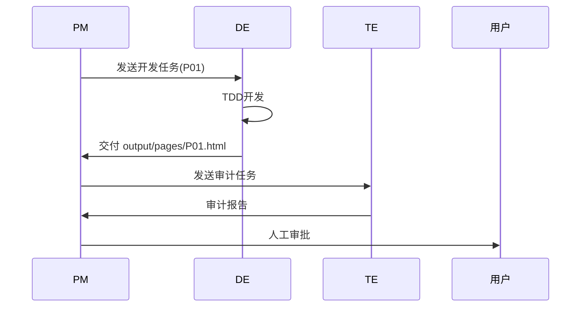

# 技术方案设计

## 元信息
- 需求编号: {REQ-ID}
- 来源: deliverables/{REQ-ID}/sa/requirement-spec.md
- 创建日期: {date}
- 作者: SA

## 设计总览
{一段话概括技术方案的核心思路}

## 页面结构设计

### 章节划分

| 章节序号 | 章节标题 | 包含页面 | 文件名 |
|---------|---------|---------|--------|
| 1       |         | P01-P03 | chapter-01.html |
| 2       |         | P04-P06 | chapter-02.html |

### 页面详细设计

#### P01: {页面标题}
- **主标题**: {标题文案}
- **重点行**: {金句/核心结论}
- **内容要点**: 
  - {要点1: 结论 + 支撑}
  - {要点2: 结论 + 支撑}
  - {要点3: 结论 + 支撑}
- **呈现建议**: {卡片/图文/表格/图表/大字金句等，DE 可根据实际效果调整}
- **图表**: {Mermaid/数据图表/无}
- **特殊组件**: {如有}

#### P02: {页面标题}
- **主标题**: 
- **重点行**: 
- **内容要点**: 
- **呈现建议**: 

## 需求→技术落实对照表

| 需求ID | 技术实现方式 | 涉及页面 | 复杂度 |
|--------|------------|---------|--------|
| FR-1   |            | P01     | 低/中/高 |
| FR-2   |            | P02     |        |

## 组件清单

| 组件名 | 用途 | 复用次数 | 来源 |
|--------|------|---------|------|
| mermaid-flow | Mermaid流程图 | {N} | 新建 |

## 样式变量

```css
/* 继承自 page-skeleton.html，如需覆盖在此声明 */
--bg-primary: #F5F0E8;
--accent: #E07A5F;
/* 自定义变量 */
```

## 交付顺序（Tasks 清单）

| 序号 | 页面 | 依赖 | 预估复杂度 |
|------|------|------|-----------|
| 1    | P01  | 无   | 低        |
| 2    | P02  | P01  | 中        |

## 时序图


